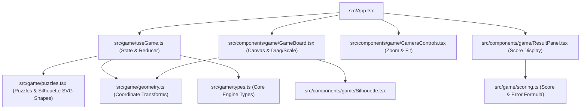

# ScaleGuess / GuessTheSize — Project Architecture & Debugging Guide

A developer guide outlining the key architecture, state flow, math models, and file responsibilities for future debugging.

---

## 1. High-Level Architecture & Active Pipeline

The codebase has two distinct generations:
1. **Active Engine (`src/game/` + `src/components/game/` + `src/App.tsx`)**:
   An interactive 2D physics/spatial canvas where players drag and resize SVG silhouettes along defined axes (height vs length) with real-world camera transforms (metres to screen pixels).
2. **Legacy/Alternate Game Model (`src/game.ts`, `src/types.ts`, `src/data/objects.ts`, `src/storage.ts`, `src/share.ts`)**:
   A Wordle/daily-quiz style model with daily seeded rounds, localStorage persistence, and shareable emoji score summaries.

---

## 2. Important & Unique Files Reference

### A. Core Active Engine (`src/game/`)

* **[src/game/geometry.ts](file:///mnt/old_d/code/guessthesize/src/game/geometry.ts)**
  * **Role:** Pure mathematical engine for coordinate conversions and camera viewports.
  * **Units:** World space is strictly measured in **metres** ($y$-axis points up); screen space is in **pixels** ($y$-axis points down).
  * **Key Functions:**
    * `screenToWorld` / `worldToScreen` / `rectToScreen`: Transforms coordinates using `Camera` (`cx`, `cy`, `zoom` in px/metre) and `Viewport` dimensions.
    * `sizeFor` / `measurementFor`: Calculates bounding dimensions based on whether an object scales along its `height` or `length`.
    * `fitCamera` / `clampCamera` / `zoomLimits`: Controls zooming bounds and auto-fitting objects with margins and padding (`VIEW_PADDING`, `MIN_ZOOM_FRACTION`, `MAX_ZOOM_MULTIPLIER`).
    * `minScaleForPx`: Computes minimum target scale ensuring target stays above screen pixel threshold (`MIN_TARGET_PX`).
  * **Debug Tip:** If silhouette sizing looks stretched, or dragging/resizing behaves erratically on window resize, inspect `rectToScreen`, `screenToWorld`, and `fitZoom`.

* **[src/game/useGame.ts](file:///mnt/old_d/code/guessthesize/src/game/useGame.ts)**
  * **Role:** Central state machine hook (`useReducer`) powering the game loop.
  * **Key State (`GameState`):**
    * `phase`: `"PLAYING"` vs `"RESULT"`.
    * `guessScale`: Current player guess in metres.
    * `finalGuessScale`: Locked-in guess scale captured when the user clicks "Lock In".
    * `referenceCenter` / `targetCenter`: World-space coordinates for object positions.
    * `camera`: Current view focus and zoom.
  * **Key Actions:** `init`, `viewport`, `moveTarget`, `resizeTarget`, `zoom`, `fit`, `lockIn`.
  * **Derived Helpers:** `referenceRect`, `guessRect`, `correctRect`, `sceneRect`.
  * **Debug Tip:** When debugging bounding box collisions or resize clamping at edge boundaries, inspect `maxScaleFactorAt` inside the `resizeTarget` action handler.

* **[src/game/types.ts](file:///mnt/old_d/code/guessthesize/src/game/types.ts)**
  * **Role:** Active engine type definitions.
  * **Key Types:**
    * `Silhouette`: ViewBox coordinates and SVG React `Shape` component.
    * `GameObject`: Object metadata (`name`, `actualMeasurement`, `axis: "height" | "length"`).
    * `Puzzle`: `{ reference: GameObject, target: GameObject }`.
    * `GamePhase`: `"PLAYING" | "RESULT"`.

* **[src/game/puzzles.tsx](file:///mnt/old_d/code/guessthesize/src/game/puzzles.tsx)**
  * **Role:** Puzzle registry and raw SVG vector silhouette definitions.
  * **Contents:** Definitions for objects (`car`, `bus`, `dog`, `horse`, `telephoneBox`, `human`, `trafficCone`, `tennisRacket`, `guitar`, `sodaCan`, `eiffelTower`, `boeing747`, `blueWhale`, etc.) and pairings in `PUZZLES`.
  * **Function:** `pickRandomPuzzle(currentId?: string)` — ensures players do not receive the same puzzle consecutively.
  * **Debug Tip:** Vector paths must tightly touch all 4 boundaries of their defined `viewBox` for aspect ratio calculations in `geometry.ts` to remain true to scale.

* **[src/game/scoring.ts](file:///mnt/old_d/code/guessthesize/src/game/scoring.ts)**
  * **Role:** Scoring and measurement formatting for round completion.
  * **Formulas:**
    * `percentError(guess, correct)`: Signed percentage difference.
    * `calculateScore(guess, correct)`: Ratio score ($0$ to $100$) based on logarithmic difference `|ln(guess / correct)|`. An exact match yields $100$; off by a factor of 2 or more gives $0$.
    * `formatMeasurement(metres)`: Converts numbers below $1\text{m}$ to centimeters (`cm`), otherwise standardizes to $2$ decimal places (`m`).

---

### B. Game Components (`src/components/game/`)

* **[src/components/game/GameBoard.tsx](file:///mnt/old_d/code/guessthesize/src/components/game/GameBoard.tsx)**
  * **Role:** Interactive canvas board that renders the objects and processes pointer/touch gestures.
  * **Features:**
    * `ResizeObserver`: Dynamically measures container DOM size and triggers `game.init()` or updates viewport.
    * Pointer capture drag handlers for moving the target object.
    * Interactive corner resize handle for scaling the target.
    * Keyboard controls: Arrow keys for translation, `+`/`-` or `[`/`]` for scaling.
    * Post-round result overlay: Shows the player's guess ghost silhouette layered against the true size (`correctRect`) silhouette with dimension labels.
  * **Debug Tip:** Check `onPointerMove` and pointer coordinate deltas if drag offset feels out of sync on high-DPI displays or mobile screens.

* **[src/components/game/Silhouette.tsx](file:///mnt/old_d/code/guessthesize/src/components/game/Silhouette.tsx)**
  * **Role:** SVG silhouette renderer.
  * **Mechanism:** Renders the object's `Shape` inside an SVG with `preserveAspectRatio="xMidYMid meet"`, tinted by `currentColor` for CSS styling.

* **[src/components/game/CameraControls.tsx](file:///mnt/old_d/code/guessthesize/src/components/game/CameraControls.tsx)**
  * **Role:** Top navigation bar controls for zoom-in, zoom-out, zoom percentage readout, and "Fit both" button.

* **[src/components/game/ResultPanel.tsx](file:///mnt/old_d/code/guessthesize/src/components/game/ResultPanel.tsx)**
  * **Role:** Summary stats dashboard displayed upon locking in.
  * **Displays:** User guess, correct size, percentage difference, and overall score out of 100.

---

### C. Application Entry & Styling

* **[src/App.tsx](file:///mnt/old_d/code/guessthesize/src/App.tsx)**
  * **Role:** Main application root.
  * **Responsibilities:** Initializes `useGame()`, manages top bar status ("Estimating" vs "Result"), renders `GameBoard`, control buttons ("Lock In" / "Next Round"), and links subcomponents.

* **[src/styles.css](file:///mnt/old_d/code/guessthesize/src/styles.css)**
  * **Role:** Primary active stylesheet loaded by [src/main.tsx](file:///mnt/old_d/code/guessthesize/src/main.tsx).
  * **Includes:** Tailwind v4 `@theme inline` setup with OKLCH theme variables, plus game-specific component classes (`.game-board`, `.lock-btn`, `.ctrl-btn`, `.handle-dot`, `.target-box`, `.result-panel`).

---

### D. Secondary / Legacy Modules

These files represent an alternate or earlier game mode implementation (multi-round daily game, persistence, and sharing):

* **[src/game.ts](file:///mnt/old_d/code/guessthesize/src/game.ts)**
  * Alternate 5-round game state engine with `createDailySeed()`, seeded pseudo-random pool shuffling, and exponential decay scoring formula.
* **[src/types.ts](file:///mnt/old_d/code/guessthesize/src/types.ts)**
  * Alternate data types (`ScaleObject`, `RoundResult`, `GameResult`, `Statistics`).
* **[src/data/objects.ts](file:///mnt/old_d/code/guessthesize/src/data/objects.ts)**
  * Extensive catalog containing 30+ scale objects across various categories with text descriptions and metadata.
* **[src/storage.ts](file:///mnt/old_d/code/guessthesize/src/storage.ts)**
  * `localStorage` persistence layer for daily streaks, average error, and statistics (`scaleguess:statistics:v2`, `scaleguess:daily:v2`).
* **[src/share.ts](file:///mnt/old_d/code/guessthesize/src/share.ts)**
  * Web Share API / clipboard formatter for scorecards with emoji status grids.
* **[src/App.css](file:///mnt/old_d/code/guessthesize/src/App.css)**
  * Standalone legacy stylesheet (not currently imported by `main.tsx`).

---

## 3. Quick Debugging Cheatsheet

| Symptom | Likely Culprit | What to Check |
| :--- | :--- | :--- |
| **Objects appearing skewed or disproportionate** | [src/game/geometry.ts](file:///mnt/old_d/code/guessthesize/src/game/geometry.ts) / [src/game/puzzles.tsx](file:///mnt/old_d/code/guessthesize/src/game/puzzles.tsx) | Verify that the SVG `Shape` paths tightly bound the `viewBox`. Check `aspectOf(obj)` and `sizeFor()`. |
| **Target cannot be dragged or resized** | [src/components/game/GameBoard.tsx](file:///mnt/old_d/code/guessthesize/src/components/game/GameBoard.tsx) | Check `drag.current` state, `pointerId` capture, and whether `state.phase === "PLAYING"`. |
| **Camera zoom stuck or clipping objects** | [src/game/geometry.ts](file:///mnt/old_d/code/guessthesize/src/game/geometry.ts) & [src/game/useGame.ts](file:///mnt/old_d/code/guessthesize/src/game/useGame.ts) | Inspect `zoomLimits()`, `fitZoom()`, and `clampCamera()`. |
| **Score calculation discrepancies** | [src/game/scoring.ts](file:///mnt/old_d/code/guessthesize/src/game/scoring.ts) | Review `calculateScore()`. Notice it is logarithmic (`1 - ln(guess/actual)/ln(2)`), whereas `game.ts` uses exponential decay. |
| **Styling or layout looks broken** | [src/styles.css](file:///mnt/old_d/code/guessthesize/src/styles.css) | Ensure `.lock-btn`, `.game-board`, and custom OKLCH color variables are defined. Note that `App.css` is not active in `main.tsx`. |
